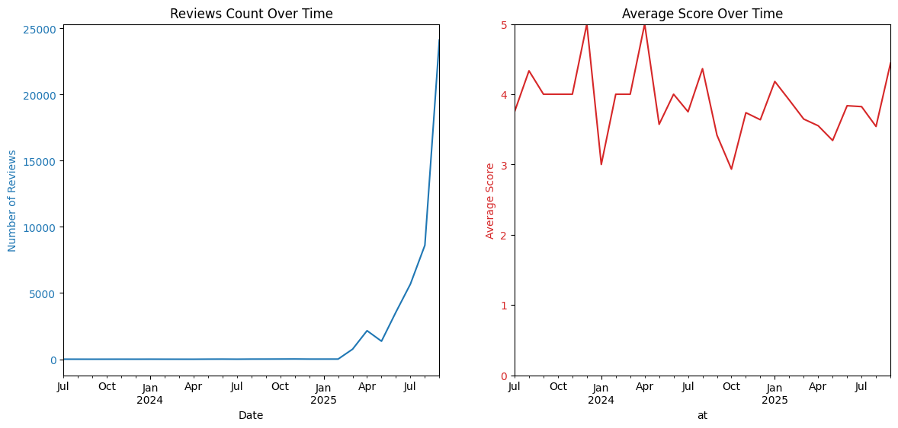
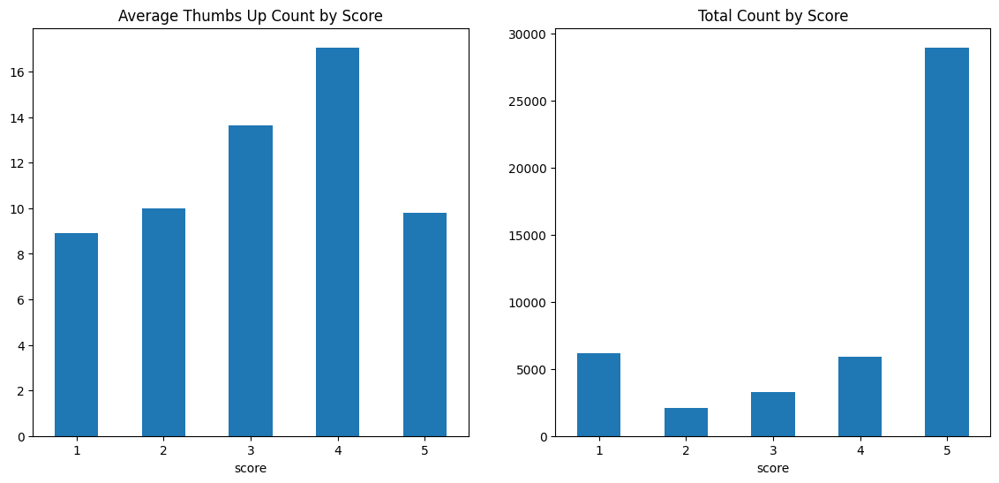

# Google_Play_store_Reviews_ChatGPT
Data Ingestion and early analysis of ChatGPT reviews sample data from Google Play store.

This is a dataset of reviews for ChatGPT in Google play store.

## Metadata
Contains 1000 Descriptive data for reviews, gained by using google_play_scraper most_relevant sort.

- Source: Google Play Store
- App: ChatGPT (`com.openai.chatgpt`)
- Collection method: google_play_scraper
- Sort mode: most_relevant
- Sample size: 1000 reviews
- Collection date: Sept 2025
- Language: English (default)

Dataset Fields
```python
{
    "reviewId": "<class 'str'>",
    "userName": "<class 'str'>",
    "userImage": "<class 'str'>",
    "content": "<class 'str'>",
    "score": "<class 'int'>",
    "thumbsUpCount": "<class 'int'>",
    "reviewCreatedVersion": "<class 'str'>",
    "at": "<class 'datetime.datetime'>",
    "replyContent": "<class 'NoneType'>",
    "repliedAt": "<class 'NoneType'>",
    "appVersion": "<class 'str'>"
}
```
Most replyContent and repliedAt values are null.

## EDA

### Score distribution
Discover the score distribution for top relevant reviews


Here is the box plot for score distribution. Mean score: 2.76, Median score: 3.0. STD: 1.56, 27% of reviews have 1 star, while 22% have 5 star.

Distribution is bimodal, with a heavy cluster at 1 star and 5 star.

### Time data
Show reviews counts and average scores over time.



Review counts peaked in August 2025. Average score dropped from 4.1 in Jan 2025 to 3.2 by Feb 2025

### Scores grouped data
Show average thumbs up by scores and total count of scores



5 score reviews gain much more thumbs up by other users than other scores.
1 score reviews have largest data amount(27%) but least amount of thumbs up count.

## Early Insight for data quality
### Pro:
All score categories (1–5) are well covered; no extreme imbalance.
High user engament, contains reviews with lots of thumbs-up.

### Con:
Heavy skew toward very recent months due to “most relevant” sort. This may underrepresent older feedback.
5 star reviews attract disproportionately high “thumbs up,” suggesting agreement bias in positive reviews.
